<div align="center">

# Agentic Edge

**The first open-source agentic hedge fund — it researches the chokepoints of the global supply chain, debates the winners, and writes the trade plan.**

[](LICENSE)
[](https://www.python.org/)
[](https://nodejs.org/)
[](https://nextjs.org/)
[](https://fastapi.tiangolo.com/)

[](CONTRIBUTING.md)

*Name a theme. The agents find the chokepoint winners, argue the case, and hand you a trade plan — every step of the reasoning on the page.*

</div>

---

Most quant tools start with a ticker. **Agentic Edge starts with a bottleneck.** The durable edge in markets sits at the **chokepoints of the global supply chain** — the single foundry behind the leading-edge node, the memory every AI accelerator depends on, the transformers the power grid can't scale without. You define the themes that map those chokepoints — *AI infrastructure, advanced memory, grid power, small modular reactors, optical networking, or your own* — and add, edit, or retire them anytime, straight from the dashboard.

For each theme a team of specialist agents fans out: they read the catalysts, pull the fundamentals, watch the options tape, and track what legendary investors are filing with the SEC. Then a **bull and a bear actually argue** the name, a research manager forges a conviction call, and a risk committee sizes it. What comes back isn't a black-box number — it's a **ranked scorecard and a complete trade plan, with every step of the agents' reasoning right there on the page.**

Connect a paper brokerage account and Agentic Edge closes the loop — entering and managing positions on its own conclusions with NAV-aware sizing, a five-stage gate stack, an early-warning detector for institutional rotation, and a kill switch one click away. It's an entire discretionary desk — research, debate, decision, execution, and risk — running as cooperating agents you can open up and inspect. **Nothing is hidden behind a model you can't question.**

> **This is research and decision-support software, not financial advice.** Live brokerage execution is disabled by default and the project actively refuses to run against a non-paper account. Markets do things no model has seen. Use at your own risk.

---

## Why this exists

Discretionary research teams spend most of their week on the same loop: build the universe, stitch provider feeds together, pre-screen for thesis fit, summarise flow, do it again tomorrow on a different theme. Agentic Edge moves that loop into a graph of cooperating agents so human time goes where it actually matters — judgement on the names the system surfaces, and the decisions to size, hold, or exit.

The system is meant to be *legible*. Open the runs page, click any agent, and read what it concluded for each ticker and why. No opaque scoring. The reasoning is the deliverable.

### What's different

- **Theme-first, not ticker-first.** You bring an investment thesis; the system finds and ranks the names that fit, not the other way around.
- **Bull and bear actually argue.** Adversarial reasoning between two researcher agents, with a research-manager synthesis and a conviction gate that pulls you out of low-confidence names automatically.
- **Options-aware.** Unusual flow, gamma exposure, and max-pain are first-class inputs to the bear case. Most agentic stacks ignore the options tape; this one doesn't.
- **Smart-money overlay.** A configurable watchlist of well-known investors is tracked straight from their public SEC filings (13F / 13D / Form-4). When two or more of them hold the same chokepoint name, that cross-fund confirmation surfaces on the name and can tilt conviction.
- **Rotation- and momentum-aware.** A detector watches for institutions rotating *out* of a theme early — using relative strength, breadth, and flow — and, on confirmation, halts new entries into that theme and tightens exit sensitivity *without* dumping on a normal down day. Momentum drives how capital is allocated across the surviving names.
- **LEAPS-only, long-only.** One disciplined playbook: deep-in-the-money long-dated calls (no short legs, no naked-leg risk, no multi-leg combos). Walking-limit execution near mid caps the worst price you'll pay, and an autonomous maintenance loop handles forward rolls and signal-driven exits.
- **Paper-only by design.** Live brokerage is a manual code change, not a config toggle. The line stays bright.

---

## What it looks like

The interface is a Next.js 15 app with a live agent-network visualisation on the home page, theme management, run history, performance tracking, and a kill switch always one click away.

- **Home — the digital trading floor.** A live, animated agent-network diagram. Each node is a specialist agent; edges animate when work is flowing through them; the active theme and chokepoint summary sit at the top.
- **Themes.** Add a theme — *AI infrastructure*, *advanced memory*, *grid power*, *small modular reactors*, *optical networking*, or your own — seed it with tickers and a thesis sentence. The universe is editable at any time.
- **Runs.** Every research run is recorded with the agent timeline, intermediate findings, and the final scorecard. Click any agent in the workflow diagram to read what it concluded for each ticker and why.
- **Scorecard.** Ranked output combining the bull/bear debate, options flow, regime read, and the trader's recommendation per name. Composite score and the supporting rationale travel together.
- **Performance.** Today's gain/loss, account equity curve, and current positions when a paper brokerage account is connected.
- **Kill switch.** One click in the sidebar halts every automation loop. The state is stored in the database so a restart can't accidentally re-arm trading.

### Home — the digital trading floor



> **Try the click-through version** — every digital employee is inspectable, and the "Run a theme" button walks the full sequence: **[live demo](https://smaan712gb.github.io/Agentic-Edge/workflow-diagram.html)**.

### Performance — paper account, live



KPI cards at the top, the 90-day equity curve drawing itself in below, and the open-positions table beneath. Once IBKR Gateway is connected, every value is the live read from the paper account.

### Themes — your investment universe


Each card is a thesis the agent team scores against. Add a theme, seed it with tickers and a one-line rationale, and the next scheduled run picks it up automatically.

### How the agents score



The system ranks names in three ordered passes — quality first, cycle weighting next, entry timing last.

**Pass 1 — Fundamental quality** (the floor; permanent, not theme-driven)

Every candidate name is scored across six fundamental dimensions:

- **Profit Generation** — earnings power, gross margin trajectory.
- **Revenue Growth** — top-line momentum and the durability of it.
- **Capital Efficiency** — ROIC, working-capital discipline, capex justified by returns.
- **Free Cash Flow Production** — cash conversion across the cycle.
- **Balance Sheet Health** — net cash, debt coverage, liquidity buffer.
- **Future Outlook** — forward demand, pricing power, structural inevitability.

The Future Outlook dimension carries extra weight by design. A name with negative current income but a confirmed chokepoint position and strong revenue growth can still earn a Buy — structural inevitability beats a clean income statement when the supply-chain position can't be substituted.

**Pass 2 — Hot-cycle weighting** (which quality names lead *today*)

A name's fundamental score gets weighted by which chokepoint themes are currently in contact. NVIDIA may score higher than Micron in absolute fundamental terms, but when memory is the binding leg of the AI cycle — HBM3e capacity is the constraint, hyperscalers are short of it, the price curve is up — Micron bubbles to the top of the leaderboard. Quality earns the right to be on the board; the hot cycle decides who's swinging the bat right now.

**Pass 3 — Entry timing** (when, not whether)

For names that clear pass 1 and pass 2, the agents look for ideal entry: unusual options flow (whale call sweeps, gamma walls, max-pain trail), GEX positioning, multi-timeframe trend, relative-strength leadership, and volume confirmation. Timing signals never override quality — they decide *when* to pull the trigger on a name the framework already wants.

The composite is on the page, the leaderboard is the ranked output, and the reasoning behind every score travels with the rank.

The illustrations above are generated from the same components that ship with the app — see `web/components/` for the React versions. Real screenshots will land in `docs/screenshots/` (see the [screenshot guide](docs/screenshots/README.md) for the filenames the README picks up automatically).

---

## How it works

1. **You add a theme.** From the frontend you create a theme — say, *AI bottlenecks: power and cooling* — and seed it with the tickers you want under research. You can edit, add, or remove names at any time. Themes also carry a one-line rationale you can revisit later.

2. **The agent team takes over.** Each run spins up a graph of specialist agents:
   - **Market analyst** reads the price action and trend regime against the theme's reference ETFs.
   - **Fundamentals analyst** pulls the latest filings, growth, and balance-sheet health.
   - **Options flow analyst** watches unusual options activity and gamma exposure.
   - **News + macro analyst** stitches together earnings, catalysts, and macro signals.
   - **Bull and bear researchers** argue the case in structured debate.
   - **Research manager** weighs the debate and writes a thesis.
   - **Trader** translates the thesis into an actionable plan with entry, sizing, and risk.
   - **Risk panel** stress-tests the plan from three perspectives (aggressive, conservative, neutral).
   - **Portfolio manager** signs off or vetoes.
   - **Theme ranker** ranks every name in the theme by composite score so you see the best-positioned candidates at the top.

3. **You read the scorecard.** Every run produces a ranked scorecard with the chain of reasoning. You can stop here and use it as decision support, or keep going.

4. **Optional execution.** If you wire a paper IBKR account, the system can attempt to enter and manage positions inside guardrails you configure. There are five gates between an idea and a fill, plus a hardware-style kill switch. Sizing is NAV-aware. Nothing trades on a live brokerage account by default — paper mode is enforced at the configuration layer.

---

## Strategy

Agentic Edge runs **one disciplined playbook: long-only LEAPS** on high-conviction theme names.

- Long a deep-in-the-money LEAP call, typically 18–24 months out, around 0.80–0.85 delta — capital-efficient exposure to the underlying with a known, capped downside (the premium paid).
- **No short legs, no diagonals, no multi-leg combos, no naked-leg risk.** Each position is a single long call.
- **NAV-aware sizing** with a per-strategy budget, so the book stays roughly equal-weight and never over-deploys.
- **Walking-limit execution near mid** caps the worst price you'll pay; if a quote stays wide the order is abandoned rather than crossing the full spread.
- An autonomous **maintenance loop** forward-rolls a LEAP when its remaining tenor falls under ~six months, and **exits only on a signal** — a thesis break (the agent team flips the rating to *Avoid*), a confirmed theme rotation, or momentum exhaustion. It does **not** force-close on an ordinary down day.

### Signal layers feeding the book

- **Scorecard** — the agent debate produces a Buy/Hold/Avoid per name; only *Buy* names are eligible to enter.
- **Smart-money** — named investors' SEC filings (13F / 13D / Form-4) are tracked; cross-fund overlap on a chokepoint name tilts conviction (and sizing).
- **Rotation detector** — flags institutions leaving a theme early (RS / breadth / flow); on confirmation it halts new entries into that theme and tightens exits.
- **Momentum** — drives allocation across eligible names.

Live brokerage execution is **disabled by default** and the system refuses to run against a non-paper account.

---

## Quick start

You'll need:

- **Node 20+** (frontend)
- **Python 3.11+** (API)
- **Interactive Brokers Gateway** in paper mode (optional, for live paper trading)
- API keys for the providers you want to use (see `.env.example`)

### 1. Configure

```bash
cp .env.example .env
# fill in the keys you have; missing keys disable the relevant capability
```

The system reads only what you give it. You can run with a partial set of providers and it will skip the agents that depend on the missing ones.

### 2. Run the API

```bash
pip install -r api/requirements.txt
python -m alembic -c api/alembic.ini upgrade head
python -m uvicorn api.app.main:app --port 8000 --reload
```

Health check: `http://127.0.0.1:8000/api/health`.

### 3. Run the web app

```bash
cd web
npm install
npm run dev
```

Open `http://localhost:3000`. The Next.js dev server proxies `/api/*` to the FastAPI app, so both run side-by-side without extra wiring.

### 4. (Optional) Connect IBKR

Start IB Gateway in paper mode, enable the API, and set `IBKR_PORT=4002` (paper). The system enforces paper mode at the config layer and refuses to start against a live account ID. If you want live, you'll have to take the safety off yourself — and that's a conversation, not a checkbox.

---

## Project layout

```text
.
├── api/               FastAPI service: routes, scheduler, autotrade loops, persistence
│   ├── app/
│   │   ├── autotrade/   Entry, maintenance, gates, alerts, heartbeat
│   │   ├── db/          SQLAlchemy 2.x async models
│   │   └── repos/       Theme / run / event repositories
│   └── alembic/       Migrations
├── web/               Next.js 15 + Tailwind v4 + React Flow frontend
│   ├── app/             Routes (themes, runs, performance)
│   └── components/      Workflow diagram, kill switch, LEAP trade builder, etc.
├── docs/              Architecture, design notes, screenshots
├── scripts/           One-off admin utilities
└── tests/             Provider smoke tests
```

The reasoning agents and provider clients live in the **`tradingagents`** package, installed automatically from `api/requirements.txt` (it's pinned to the [engine repo](https://github.com/smaan712gb/TradingAgents)). You don't vendor it into this repo — `pip install -r api/requirements.txt` pulls it. To hack on the engine itself, clone that repo and `pip install -e .` over the pinned version. See `docs/ARCHITECTURE.md` for the full breakdown — analyst nodes, the gate stack, the walking-limit executor, and the persistence schema.

---

## What's real, what's a stub

| Layer | Status |
| --- | --- |
| Frontend | Real |
| API contract | Real and stable |
| Theme + run persistence | Real (SQLAlchemy + Alembic; SQLite for dev, Postgres-ready) |
| Provider clients (market data, options flow, fundamentals, macro, brokerage, reasoning models) | Real |
| Agent scorecard graph | Working end-to-end |
| Smart-money tracker (13F / 13D / Form-4, cross-fund overlap) | Working |
| Rotation detector + momentum allocation | Working |
| Paper-brokerage execution (LEAPS, single-leg walking-limit near mid) | Working |
| Maintenance loop (forward rolls + signal-driven exits) | Working |
| Live-broker mode | Disabled by design — paper only |

Treat anything not in the list as planned but unverified.

---

## Configuration

The service is configured entirely through environment variables — see `.env.example` for the full list. A few that matter:

- Reasoning-model API key — required to run real agent flows.
- Market-data, options-flow, fundamentals, and macro provider keys — missing keys disable the corresponding analyst; see `.env.example` for the exact variable names.
- Paper-brokerage host / port / client id / mode — paper-trading wiring. The system refuses to start unless the mode flag is set to paper.
- `ADMIN_API_TOKEN` — required for admin endpoints (kill switch, scheduler, reconcile). The service refuses placeholder values like `changeme`.

---

## Roadmap

Things on the near horizon:

- Per-symbol options-flow staleness checks pre-trade.
- A continuous account-health monitor that alerts on broker, margin, and position/intent drift.
- Wiring the smart-money conviction read directly into the entry gate (today it surfaces and tilts sizing; next it gates).
- A support-reclaim / mean-reversion signal so dip entries aren't missed by the trend-following setup score.
- A library of saved themes you can fork.

If any of those interest you, the contributing guide explains how to pick one up.

---

## Disclaimer

Agentic Edge is research and decision-support software. It is **not** investment advice, a recommendation to buy or sell any security, or a guarantee of any outcome. The default execution mode is paper trading and the system actively refuses to operate against a live account without explicit, deliberate configuration changes. Past performance is not indicative of future results. Markets can and do produce outcomes that no model has seen. Use this software at your own risk and consult a licensed financial advisor before making investment decisions.

---

## Contributing

Issues, bug reports, and pull requests are welcome. Read [CONTRIBUTING.md](CONTRIBUTING.md) to see how the project is organised and which contributions are most useful right now. Security reports go through [SECURITY.md](SECURITY.md), not public issues.

Topics that help others find this project on GitHub: `agentic-ai`, `quantitative-finance`, `options-trading`, `nextjs`, `fastapi`, `paper-trading`, `investment-research`.

---

## Star history

If this project saved you a few mornings of research, consider starring the repo. It's the cheapest way to help others find it.

[](https://star-history.com/#smaan712gb/Agentic-Edge&Date)

---

## License

[MIT](LICENSE) — with an additional financial-software disclaimer. The short version: do whatever you want with the code, but don't blame us for what the market does.

The agent + provider engine (the `tradingagents` package) is licensed separately under the **Apache License 2.0**.

---

## Acknowledgements

The reasoning engine began as a fork of the open-source **[TradingAgents](https://github.com/TauricResearch/TradingAgents)** multi-agent framework by Tauric Research (Apache License 2.0), and has been substantially extended for Agentic Edge — a thematic chokepoint universe, options-flow and smart-money signals, a theme-rotation detector, the LEAPS execution + maintenance loops, and the FastAPI/Next.js platform around it. Our fork lives at [smaan712gb/TradingAgents](https://github.com/smaan712gb/TradingAgents). See [`NOTICE`](NOTICE) for attribution details.
